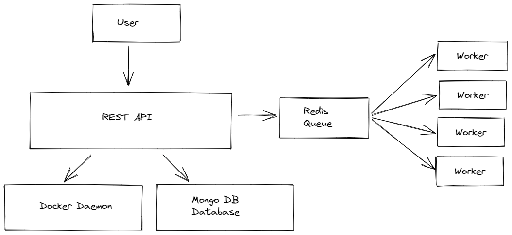

# Pandora's Boxes

This repository contains the code for the backend of the cloud-ide project that I am currently working on. 

The cloud-ide project aims to give developers access to development environments of 
   
Users can also share their dockerfiles with other users and access to development environments so that they can focus on coding rather than setting up and maintaining development environemnts. This project also aims to allow developers to experiment with different falvours of operating systems without a complex setup

This is still an incomplete project and I will be adding database functions and frontend client soon.

# Architecture



 - ## REST API
    The REST API handles the task of creating a docker container according to the specification provided by the user, it communicates with the docker daemon and creates docker images and containers.
 - ## Redis Queue
    Since the tasks of createing a doccker image, container and execution of some commands take a lot of time, Redis queue is being used as a task queue, when the REST API receives a request for creating a docker image or container or execution of command it adds it to the Redis task queue and returns the task_id to the client.

    This task_id is used by the client to subscribe to a Server Sent Event which sends the status of the build or execution tasks.

- ## Worker
    The redis workers dequeue tasks from the redis task queue and execute them, upon completion the result is obtained.

# Running this project

**Note: Currently the API can be run only on Linux or WSL**

- Install Python (3.10 or newer)
- Install Docker and Docker Compose
- Create a python virtual environment and install all the required libraries in the requirements.txt from the command
    ```shell
    pip install -r requirements.txt
    ```
- Run all the services required
    ```
    docker-compose up
    ```
- Run the API using
    ```
    python main.py
    ```

